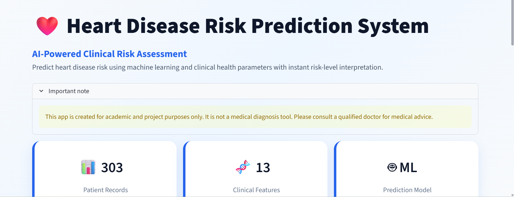
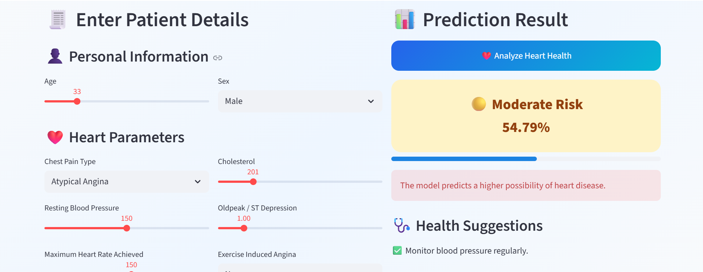
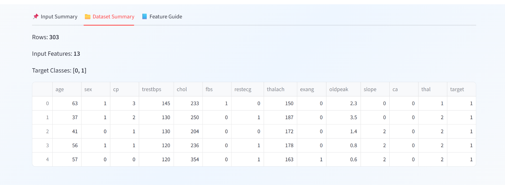
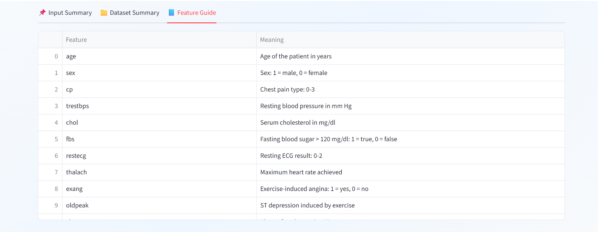

# Heart Disease Prediction System

An interactive Machine Learning web application that predicts the risk of heart disease using clinical health parameters. The application provides a clean and user-friendly interface for entering patient information, estimating heart disease risk, and displaying health recommendations based on the prediction.

---

## Overview

Heart Disease Prediction System is a Machine Learning-based healthcare application developed using Python and Streamlit. The project predicts whether a patient is at risk of heart disease by analyzing important clinical parameters such as age, blood pressure, cholesterol level, chest pain type, ECG results, and other medical attributes.

The application is designed with a modern and responsive interface, making it easy to understand and use for educational purposes.

---

## Features

- Interactive and responsive Streamlit web application
- Machine Learning-based heart disease prediction
- Probability-based risk prediction
- Low, Moderate and High risk indication
- Personalized health suggestions
- Clinical feature guide for every input parameter
- Dataset summary dashboard
- Input summary after prediction
- Model comparison report
- Modern healthcare-inspired user interface

---

## Application Screenshots

### Homepage



---

### Prediction Result



---

### Dataset Summary



---

### Feature Guide



---


### Live Demo
https://heart-disease-risk-prediction-system-2110.streamlit.app


## Technologies Used

- Python
- Streamlit
- Scikit-learn
- Pandas
- NumPy
- Joblib
- JSON

---

## Project Structure

```text
Heart-Disease-Prediction-System/
│
├── data/
│   └── heart_data.csv
│
├── models/
│   └── heart_disease_model.pkl
│
├── notebooks/
│   └── Heart_Disease_Prediction.ipynb
│
├── reports/
│   ├── best_model_summary.json
│   └── model_comparison.csv
│
├── screenshots/
│
├── app.py
├── train_model.py
├── feature_info.json
├── requirements.txt
└── README.md
```

---

## Installation

Clone the repository

```bash
git clone https://github.com/psb2110-glitch/Heart-Disease-Prediction-System.git
```

Move into the project directory

```bash
cd Heart-Disease-Prediction-System
```

Install the required dependencies

```bash
pip install -r requirements.txt
```

---

## Running the Application

```bash
streamlit run app.py
```

The application will be available at:

```
http://localhost:8501
```

---

## Dataset Information

The model is trained using a heart disease dataset containing **303 patient records** with **13 clinical features**, including:

- Age
- Sex
- Chest Pain Type
- Resting Blood Pressure
- Cholesterol
- Fasting Blood Sugar
- Resting ECG
- Maximum Heart Rate Achieved
- Exercise-Induced Angina
- Oldpeak
- Slope
- Number of Major Vessels
- Thalassemia

---

## Machine Learning Workflow

- Data Collection
- Data Preprocessing
- Feature Selection
- Model Training
- Model Evaluation
- Model Saving
- Streamlit Web Application

---

## Project Highlights

- Modern healthcare dashboard
- Interactive patient information form
- Risk probability visualization
- Personalized health recommendations
- Dataset exploration section
- Clinical feature explanation section
- Clean project structure suitable for GitHub portfolio

---

## Future Improvements

- User authentication
- Patient history management
- PDF health report generation
- Doctor dashboard
- Cloud database integration
- Explainable AI (SHAP/LIME)
- Mobile responsive optimization

---

## Disclaimer

This application is developed for **academic and educational purposes only**. It is **not intended for medical diagnosis or treatment**. Please consult a qualified healthcare professional for medical advice.

---

## Author

**Priyanshu Sekhar Bhuyan**

B.Tech Computer Science and Engineering

Machine Learning | Python | Streamlit | Scikit-learn
